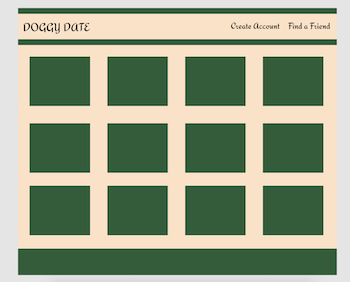

# Doggy-Date

## Overview

Doggy Date is a MERN Stack application (Mongo, Express, React, Node). It was created in with my dog in mind who is a "big dog" trapped in a smaller dogs body. She is rough yet very playful and plays well with larger dogs rather than small dogs. For this reason I created an application where users can create a profile for their furry four legged friends and find local dogs to propose a play date.

### [Click here for the Doggy Dates deployed version on Heroku!](https://dogdatesandmore.herokuapp.com/) 

### [Click here for Trello Board](https://trello.com/b/Gc7CKQ18/doggy-date)

## Built With
* HTML5
* CSS3
* Javascript
* MongoDb
* Express
* Node.js
* React

## What I Learned

This project solidified my understanding of restful routing and how to create a working backend. It was the smoother part of this project, while React was more of a challenge. With that being said I accomplished my goals with Doggy Dates and learned a lot about Styled Components and how to target specific divs. In the final version of this application I will implement AuthO and use an external API to display dogpark coordinates.

## Wire Frame

